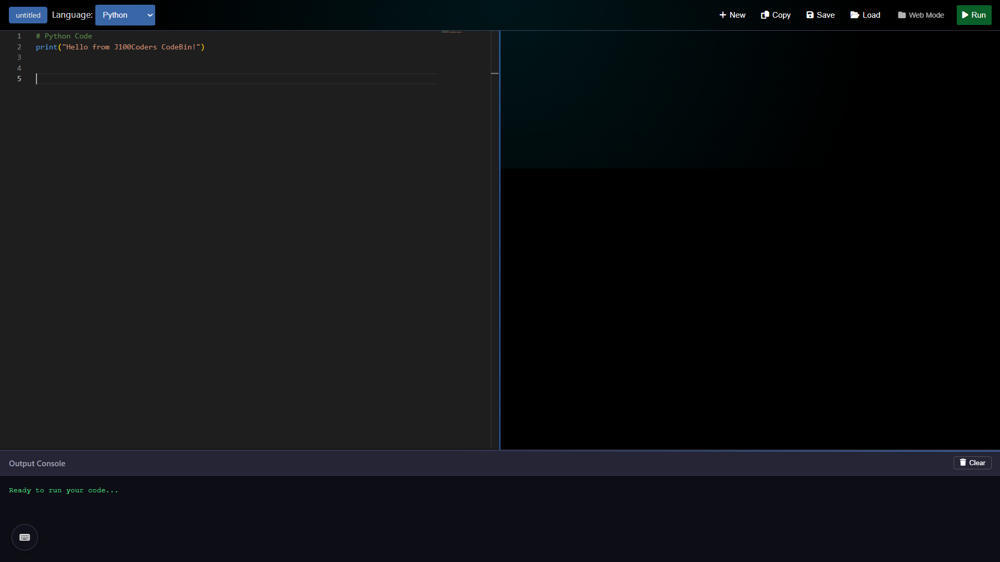
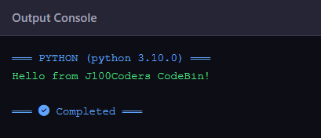
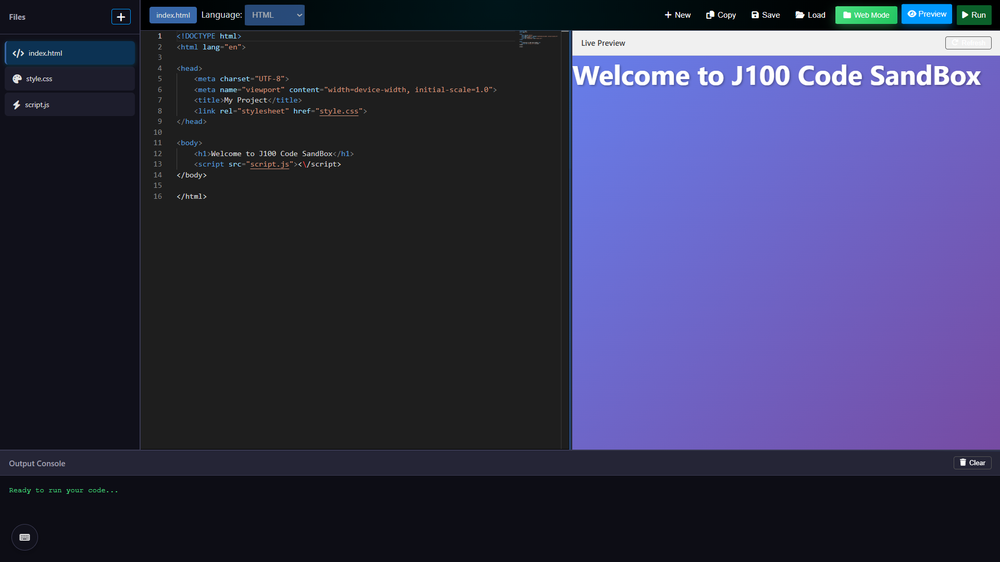
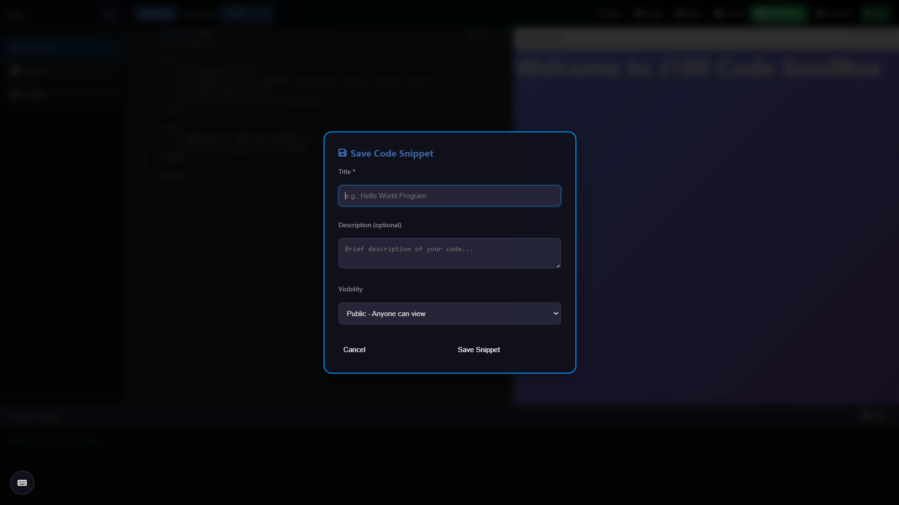
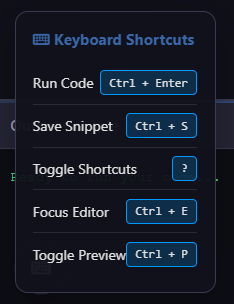

# J100 Coding Sandbox

<div align="center">

**A powerful web-based code editor and execution platform**

Write, run, save, and share code snippets in 11+ programming languages

[Features](#features) • [Getting Started](#getting-started) • [API Documentation](#api-documentation) • [Architecture](#architecture)

</div>

---

## Overview

**J100 Coding Sandbox** (also known as **CodeBin**) is a web-based code editor and execution platform similar to CodePen, JSFiddle, or Repl.it. It provides a complete development environment in your browser with:

- **Monaco Editor** (VS Code's editor engine)
- **Real-time code execution** in a sandboxed environment
- **Multi-file project support** with live preview
- **Snippet management** (save, load, share)
- **Modern dark theme** with smooth animations
- **Keyboard shortcuts** for productivity

---

## Features

### Editor Experience

- **Monaco Editor** with full VS Code features:
  - Syntax highlighting for 11+ languages
  - IntelliSense and auto-completion
  - Multi-cursor editing
  - Find and replace
  - Code folding
  - Minimap navigation

### Code Execution

- **Sandboxed execution** via Piston API
- **Instant results** in output console
- **Error handling** with detailed messages
- **Execution time tracking**
- Support for:
  - Python 3.10.0
  - JavaScript (Node.js 18.15.0)
  - TypeScript 5.0.3
  - C++ 10.2.0
  - C 10.2.0
  - Java 15.0.2
  - C# 6.12.0
  - PHP 8.2.3
  - Ruby 3.0.1
  - Go 1.16.2
  - Rust 1.68.2
  - **SQL (SQLite)** with persistent databases

### SQL Sandbox

- **Persistent SQLite databases** per snippet
- **Full SQL support**: CREATE, INSERT, UPDATE, DELETE, SELECT
- **Table output** with styled grid display
- **Database isolation** - each snippet has its own DB
- **Reset button** to start fresh
- **Security features**:
  - Blocked dangerous commands (ATTACH, LOAD_EXTENSION)
  - Query timeout (5 seconds)
  - Max database size (5MB)
  - Row limit (1000 per query)

### Project Mode

- **VS Code-like file tree** in sidebar
- **Multi-file management**:
  - Add/delete files dynamically
  - Switch between files
  - File icons based on type
- **Live preview** for HTML/CSS/JS projects
- **Auto-refresh** with smart debouncing

### Snippet Management

- **Save snippets** with title and description
- **Three visibility levels**:
  - **Public** (visible to everyone)
  - **Unlisted** (accessible via link)
  - **Private** (your eyes only)
- **Shareable URLs** (e.g., `?snippet=abc123XY`)
- **View counter** for tracking popularity
- **My Snippets** browser with search
- **Quick load** from your library

### Keyboard Shortcuts

| Shortcut     | Action               |
| ------------ | -------------------- |
| `Ctrl+Enter` | Run code             |
| `Ctrl+S`     | Save snippet         |
| `Ctrl+/`     | Toggle comment       |
| `Ctrl+F`     | Find in code         |
| `Ctrl+H`     | Replace in code      |
| `?`          | Show shortcuts panel |

---

## Screenshots

### Main Editor Interface

<div align="center">
  
  <p><em>Monaco Editor with syntax highlighting and dark theme</em></p>
</div>

### Code Execution

<div align="center">
  
  <p><em>Real-time code execution with output console</em></p>
</div>

### Project Mode with Live Preview

<div align="center">
  
  <p><em>Multi-file project with sidebar and live HTML/CSS/JS preview</em></p>
</div>

### Snippet Management

<div align="center">
  
  <p><em>Browse, load, and manage your saved code snippets</em></p>
</div>

### Save Dialog

<div align="center">
  
  <p><em>Save snippets with title, description, and visibility settings</em></p>
</div>

### Keyboard Shortcuts Panel

<div align="center">
  
  <p><em>Quick reference for all keyboard shortcuts</em></p>
</div>

### Mobile Responsive View

<div align="center">
  
  <p><em>Fully responsive design for mobile devices</em></p>
</div>

---

## Architecture

```
┌─────────────────────────────────────────────────┐
│           Frontend (index.php)                  │
│  Monaco Editor + UI + Live Preview              │
└────────────────┬────────────────────────────────┘
                 │
                 ▼
┌─────────────────────────────────────────────────┐
│           PHP REST API (api/)                   │
│  Snippets CRUD + Code Execution Proxy           │
└────────┬─────────────────────────┬──────────────┘
         │                         │
         ▼                         ▼
┌──────────────────┐    ┌─────────────────────────┐
│  MySQL Database  │    │   Piston API (External) │
│  code_snippets   │    │   Sandboxed Execution   │
└──────────────────┘    └─────────────────────────┘
```

### Frontend Architecture

**Single Page Application** built with:

- Vanilla JavaScript (no frameworks)
- Monaco Editor for code editing
- Dynamic modal system
- Real-time preview in sandboxed iframe
- Responsive CSS Grid layout

### Backend Architecture

**RESTful API** with PHP:

- `snippets.php` - CRUD operations
- `execute.php` - Code execution proxy
- `config.php` - Database connection
- PDO with prepared statements

---

## Getting Started

### Prerequisites

- **XAMPP** (or any Apache + PHP + MySQL stack)
- PHP 7.4 or higher
- MySQL 5.7 or higher
- Modern web browser

### Installation

1. **Clone or download** the project to your XAMPP htdocs folder:

   ```bash
   cd C:\xampp\htdocs
   git clone <repository-url> ide
   ```

2. **Create the database**:

   ```sql
   CREATE DATABASE redink_j100Coders;
   USE redink_j100Coders;

   CREATE TABLE code_snippets (
       id VARCHAR(12) PRIMARY KEY,
       title VARCHAR(255) NOT NULL,
       description TEXT,
       language VARCHAR(50) NOT NULL,
       code LONGTEXT NOT NULL,
       permissions ENUM('public','unlisted','private') DEFAULT 'unlisted',
       author_id VARCHAR(100),
       views INT DEFAULT 0,
       created_at TIMESTAMP DEFAULT CURRENT_TIMESTAMP,
       updated_at TIMESTAMP DEFAULT CURRENT_TIMESTAMP ON UPDATE CURRENT_TIMESTAMP,
       INDEX idx_author (author_id),
       INDEX idx_permissions (permissions),
       INDEX idx_created (created_at)
   );
   ```

3. **Configure database connection** in `api/config.php`:

   ```php
   private $host = "localhost";
   private $db_name = "redink_j100Coders";
   private $username = "your_username";
   private $password = "your_password";
   ```

4. **Start Apache and MySQL** in XAMPP Control Panel

5. **Open in browser**:
   ```
   http://localhost/ide/
   ```

### Quick Start

1. Select a language from the dropdown
2. Write your code in the editor
3. Click **Run** (or press `Ctrl+Enter`)
4. View output in the console below

---

## API Documentation

### Base URL

```
http://localhost/ide/api/
```

### Endpoints

#### 1. Execute Code

**POST** `/api/execute.php`

Execute code in a sandboxed environment.

**Request:**

```json
{
  "language": "python",
  "code": "print('Hello World')",
  "stdin": "", // Optional
  "args": [] // Optional
}
```

**Response:**

```json
{
  "success": true,
  "output": "Hello World\n",
  "language": "python",
  "version": "3.10.0",
  "execution_time": 45
}
```

#### 2. Create Snippet

**POST** `/api/snippets`

Save a new code snippet.

**Request:**

```json
{
  "title": "Hello World in Python",
  "description": "A simple hello world example",
  "language": "python",
  "code": "print('Hello World')",
  "permissions": "public",
  "author_id": "16"
}
```

**Response:**

```json
{
  "message": "Snippet created successfully",
  "id": "aB3x9Kz1",
  "url": "?snippet=aB3x9Kz1"
}
```

#### 3. Get Snippet

**GET** `/api/snippets/{id}`

Retrieve a specific snippet by ID.

**Response:**

```json
{
  "id": "aB3x9Kz1",
  "title": "Hello World in Python",
  "description": "A simple hello world example",
  "language": "python",
  "code": "print('Hello World')",
  "permissions": "public",
  "author_id": "16",
  "views": 42,
  "created_at": "2026-01-07 10:30:00",
  "updated_at": "2026-01-07 10:30:00"
}
```

#### 4. List User Snippets

**GET** `/api/snippets?author={author_id}`

Get all snippets by a specific author.

**Response:**

```json
[
  {
    "id": "aB3x9Kz1",
    "title": "Hello World",
    "language": "python",
    "views": 42,
    "created_at": "2026-01-07 10:30:00"
  }
]
```

#### 5. Delete Snippet

**DELETE** `/api/snippets/{id}`

Delete a snippet.

**Response:**

```json
{
  "message": "Snippet deleted successfully"
}
```

---

## Database Schema

### Table: `code_snippets`

| Column        | Type         | Description                        |
| ------------- | ------------ | ---------------------------------- |
| `id`          | VARCHAR(12)  | Primary key, 8-character random ID |
| `title`       | VARCHAR(255) | Snippet title                      |
| `description` | TEXT         | Optional description               |
| `language`    | VARCHAR(50)  | Programming language               |
| `code`        | LONGTEXT     | Source code                        |
| `permissions` | ENUM         | public, unlisted, or private       |
| `author_id`   | VARCHAR(100) | User identifier from URL param     |
| `views`       | INT          | View counter                       |
| `created_at`  | TIMESTAMP    | Creation timestamp                 |
| `updated_at`  | TIMESTAMP    | Last update timestamp              |

### Indexes

- `PRIMARY KEY` on `id`
- `INDEX` on `author_id` (for user queries)
- `INDEX` on `permissions` (for public listing)
- `INDEX` on `created_at` (for sorting)

---

## User Interface

### Main Editor View

- **Header**: Logo, language selector, controls
- **Editor**: Monaco editor with full screen support
- **Output Console**: Resizable output panel
- **Sidebar**: File tree (in Project Mode)
- **Modals**: Save, Load, Add File dialogs

### Project Mode

- Toggle with **Project Mode** button
- Sidebar appears with file tree
- Add files with `+` button
- Delete files (except last one)
- Click files to switch

### Live Preview

- Available in Project Mode for HTML/CSS/JS
- Toggle with **Preview** button
- Sandboxed iframe rendering
- Auto-refresh on changes (500ms debounce)

---

## User Workflows

### Scenario 1: Quick Code Execution

1. Open the application
2. Select language (e.g., Python)
3. Write code in editor
4. Click **Run** or press `Ctrl+Enter`
5. View output in console

### Scenario 2: Saving a Snippet

1. Write your code
2. Click **Save** button
3. Fill in:
   - Title
   - Description (optional)
   - Visibility (public/unlisted/private)
4. Click **Save Snippet**
5. Copy the shareable URL

### Scenario 3: Loading a Snippet

1. Click **Load** button
2. Browse your snippets
3. Click on a snippet to load it
4. Edit and run

### Scenario 4: Multi-file Web Project

1. Click **Project Mode** to enable
2. System creates: `index.html`, `style.css`, `script.js`
3. Add more files with `+` button
4. Edit files by clicking them
5. Click **Preview** to see live result
6. Changes refresh automatically

---

## Security

### Current Protections

- **Sandboxed execution** via Piston API (no local code execution)
- **SQL injection prevention** (PDO prepared statements)
- **XSS prevention** in output rendering
- **CORS headers** configured
- **Input validation** on API endpoints

### Known Limitations

- **No real authentication** - Uses URL parameter `?as=16` for user ID
- **No rate limiting** - API can be abused
- **No CSRF protection**
- **Database credentials** hardcoded in config
- **No ownership verification** on delete operations
- **HTML preview** could be exploited with malicious code

### Recommendations for Production

1. Implement proper authentication (JWT, sessions)
2. Add rate limiting on execution endpoint
3. Move credentials to environment variables
4. Add CSRF tokens to forms
5. Verify ownership before delete operations
6. Sanitize HTML preview content
7. Add API key requirement
8. Implement request logging
9. Add IP-based throttling
10. Set up HTTPS

---

## Technology Stack

| Layer              | Technology                     |
| ------------------ | ------------------------------ |
| **Frontend**       | Vanilla JavaScript             |
| **Editor**         | Monaco Editor (VS Code engine) |
| **Backend**        | PHP 7.4+                       |
| **Database**       | MySQL 5.7+                     |
| **Code Execution** | Piston API (https://emkc.org)  |
| **Server**         | Apache with mod_rewrite        |
| **Icons**          | Font Awesome 6                 |
| **Styling**        | Custom CSS (no frameworks)     |

---

## Project Structure

```
ide/
├── index.php              # Main application (UI + JS)
├── README.md              # This file
├── error_log              # PHP error logs
├── api/
│   ├── config.php         # Database connection class
│   ├── snippets.php       # Snippet CRUD operations
│   ├── execute.php        # Code execution proxy
│   ├── api.php            # Legacy/backup API
│   └── .htaccess          # API URL rewriting
└── assets/                # Future assets folder
```

---

## Roadmap / Future Enhancements

### Authentication & Users

- [ ] User registration and login
- [ ] JWT-based authentication
- [x] User profiles and avatars
- [ ] Password reset functionality

### Snippet Features

- [ ] Snippet search and filtering
- [ ] Public snippet gallery
- [ ] Snippet forking (clone and edit)
- [ ] Snippet versioning
- [ ] Export as ZIP
- [ ] Embed snippets in other sites
- [ ] Syntax validation before execution
- [ ] Code formatting (Prettier)

### Collaboration

- [ ] Real-time collaborative editing
- [ ] Comments and discussions
- [ ] Snippet likes/favorites
- [ ] User following system

### Editor Enhancements

- [ ] Multiple editor themes
- [ ] Custom key bindings
- [ ] Code snippets library
- [ ] Git integration
- [ ] Vim/Emacs modes

### Infrastructure

- [ ] Self-hosted execution (Docker containers)
- [ ] Rate limiting and quotas
- [ ] Analytics dashboard
- [ ] API documentation (Swagger)
- [ ] Unit tests and CI/CD
- [ ] CDN for static assets
- [ ] WebSocket for real-time features

---

## Known Issues

1. **Monaco Editor** may be slow on older browsers
2. **Project Mode** file deletion requires page refresh
3. **SQL execution** shows message but doesn't actually run
4. **Piston API** dependency means downtime if service is unavailable
5. **Large code outputs** may exceed browser display limits

---

## Contributing

Contributions are welcome! To contribute:

1. Fork the repository
2. Create a feature branch (`git checkout -b feature/amazing-feature`)
3. Commit your changes (`git commit -m 'Add amazing feature'`)
4. Push to the branch (`git push origin feature/amazing-feature`)
5. Open a Pull Request

### Development Guidelines

- Follow existing code style
- Comment complex logic
- Test on multiple browsers
- Update documentation
- Keep commits atomic

---

## Browser Support

| Browser | Supported | Notes          |
| ------- | --------- | -------------- |
| Chrome  | Yes       | Recommended    |
| Firefox | Yes       | Recommended    |
| Edge    | Yes       | Chromium-based |
| Safari  | Yes       | 14+            |
| Opera   | Yes       |                |
| IE 11   | No        | Not supported  |

---

## License

## This project is currently under **Apache 2.0 License**

## Acknowledgments

- **Monaco Editor** - Microsoft's excellent code editor
- **Piston API** - Free code execution service by Engineer Man
- **Font Awesome** - Beautiful icon library
- **XAMPP** - Easy local development environment

---

## Contact & Support

**Project Maintainer**: [Saintdannyy]  
**Email**: [saintdannyyy@gmail.com]  
**Website**: [https://saintdannyyy.vercel.app](https://saintdannyyy.vercel.app)

---

<div align="center">

**If you find this project useful, please consider giving it a star!**

Made with love by the J100 Team

</div>
